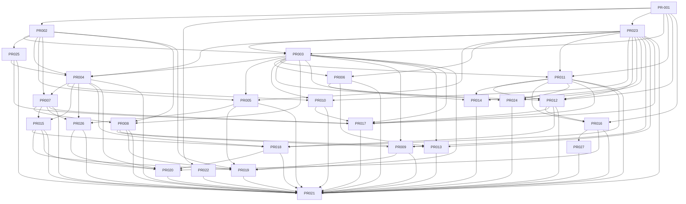

# Bareline PR Dependencies and Parallel Execution

This file is the controller view. A coding agent normally only needs its assigned PR file, `03_PR_TRACKER.md` and, for architecture questions, `07_DECISION_LOG.md`.

## Dependency table

The **Parallel peers** column lists every other PR in the same recommended execution wave. Those PRs may be assigned to separate agents once the dependencies for that wave are merged/stable.

| PR | Direct dependencies | Recommended wave | Parallel peers |
|---|---|---:|---|
| PR-001 | None | 0 | None |
| PR-002 | PR-001 | 1 | PR-022, PR-023 |
| PR-022 | PR-001 | 1 | PR-002, PR-023 |
| PR-023 | PR-001 | 1 | PR-002, PR-022 |
| PR-003 | PR-001, PR-002, PR-023 | 2 | PR-025 |
| PR-025 | PR-002 | 2 | PR-003 |
| PR-004 | PR-002, PR-003, PR-023, PR-025 | 3 | PR-005, PR-006, PR-011 |
| PR-005 | PR-002, PR-003, PR-023 | 3 | PR-004, PR-006, PR-011 |
| PR-006 | PR-003, PR-023 | 3 | PR-004, PR-005, PR-011 |
| PR-011 | PR-001, PR-003, PR-023 | 3 | PR-004, PR-005, PR-006 |
| PR-007 | PR-002, PR-004 | 4 | PR-010, PR-012, PR-014 |
| PR-010 | PR-003, PR-004, PR-023 | 4 | PR-007, PR-012, PR-014 |
| PR-012 | PR-001, PR-003, PR-011, PR-023 | 4 | PR-007, PR-010, PR-014 |
| PR-014 | PR-006, PR-011, PR-023 | 4 | PR-007, PR-010, PR-012 |
| PR-008 | PR-002, PR-003, PR-007 | 5 | PR-015, PR-016, PR-024, PR-026 |
| PR-015 | PR-004, PR-007 | 5 | PR-008, PR-016, PR-024, PR-026 |
| PR-016 | PR-001, PR-011, PR-012 | 5 | PR-008, PR-015, PR-024, PR-026 |
| PR-024 | PR-003, PR-011, PR-023 | 5 | PR-008, PR-015, PR-016, PR-026 |
| PR-026 | PR-004, PR-005, PR-007 | 5 | PR-008, PR-015, PR-016, PR-024 |
| PR-009 | PR-003, PR-008, PR-023 | 6 | PR-013, PR-017, PR-018 |
| PR-013 | PR-003, PR-006, PR-008, PR-023 | 6 | PR-009, PR-017, PR-018 |
| PR-017 | PR-003, PR-007, PR-010, PR-011, PR-012, PR-023, PR-025 | 6 | PR-009, PR-013, PR-018 |
| PR-018 | PR-004, PR-011, PR-012, PR-015 | 6 | PR-009, PR-013, PR-017 |
| PR-019 | PR-002, PR-003, PR-005, PR-008, PR-009, PR-015 | 7 | PR-027 |
| PR-027 | PR-016 | 7 | PR-019 |
| PR-020 | PR-004, PR-015, PR-016, PR-018, PR-026 | 8 | None |
| PR-021 | PR-004, PR-005, PR-006, PR-007, PR-008, PR-009, PR-010, PR-011, PR-012, PR-013, PR-014, PR-015, PR-016, PR-017, PR-018, PR-019, PR-020, PR-022, PR-023, PR-024, PR-025, PR-026, PR-027 | 9 | None |

## Recommended waves

### Wave 0 — foundation

`PR-001` — workspace, winit shell, render contracts, `RecordingBackend`, command core, `xtask perf` skeleton, repository hygiene.

### Wave 1 — independent cores

`PR-002` document engine, `PR-022` portability guardrail, `PR-023` UI primitives and controls.

### Wave 2 — editor surface and diff core

`PR-003` virtualized editor surface, `PR-025` OS-neutral diff engine.

### Wave 3 — parallel editor foundations

`PR-004` file lifecycle and recovery, `PR-005` search, `PR-006` power editing, `PR-011` menus and palette.

### Wave 4 — encoding, views and configuration

`PR-007` encoding, `PR-010` split views and tab UI, `PR-012` settings and themes, `PR-014` macros and external commands.

### Wave 5 — language, monitoring, extensions, accessibility and replace-in-files

`PR-008` syntax, `PR-015` file watching and tail, `PR-016` extension platform, `PR-024` accessibility, `PR-026` replace in files.

### Wave 6 — workspace intelligence, compare workspace and Windows packaging

`PR-009` explorer and outline, `PR-013` completion and comments, `PR-017` utilities and Compare Workspace, `PR-018` installer, CLI and updater.

PR-017 starts only after PR-010, PR-012 and PR-025 are stable because the Compare Workspace reuses split-view synchronization, semantic theme tokens and the `crates/diff` engine.

### Wave 7 — performance measurement and first-party extensions

`PR-019` huge-file profiling and benchmark suite, `PR-027` JSON, XML and Hex extensions.

### Wave 8 — security and recovery hardening

`PR-020`

### Wave 9 — integrated Windows release QA

`PR-021`

## Critical paths

- **Editor path:** PR-001 → PR-002 → PR-003 → PR-004 → PR-007 → PR-008 → PR-019 → PR-021 (PR-013 completion branches from PR-008 and PR-006 into PR-021)
- **Data safety path:** PR-001 → PR-002 → PR-004 → PR-015 → PR-018 → PR-020 → PR-021
- **Search path:** PR-001 → PR-002/PR-003 → PR-005 → PR-026 → PR-021
- **Extension path:** PR-001 → PR-011/PR-012 → PR-016 → PR-027 → PR-020 → PR-021
- **UI path:** PR-001 → PR-023 → PR-003 → PR-011 → PR-012 → PR-024 → PR-021
- **Portability path:** PR-001 → PR-022 runs early and should remain green as all later core PRs land.

## Parallelization rules

1. A PR can start once every dependency listed in its own file has a stable merged interface. It does not have to wait for unrelated QA/release work.
2. Avoid editing another PR's primary crate unless the interface contract requires a small compatible change; coordinate through a narrow shared-contract commit.
3. PR-022 is intentionally early: it should catch accidental Windows coupling while changes are cheap.
4. PR-019 can start benchmark tooling earlier, but final measurements/fixes require its listed feature dependencies.
5. PR-020 hardens already-implemented paths; it should not be used as an excuse to postpone obvious security practices in earlier PRs.
6. PR-021 is integration/polish, not the place to implement whole missing subsystems.
7. Performance numbers never block a merge; architecture rules do (ADR-10).
8. Crate ownership: PR-011 owns `crates/commands`, PR-023 owns `crates/ui` controls, PR-002 owns `crates/document`, PR-025 owns `crates/diff`; other PRs register or consume.

## Mermaid dependency graph

## v1.2 integration boundaries

PR-001 defines codec, filesystem capability, verified-package and render/input contracts before consumers begin. PR-004 starts with UTF-8 and trusted local filesystem implementations; PR-007 and PR-015 own later codec/watcher/remote integration. PR-005 starts UTF-8-only and PR-007 owns non-UTF-8 folder search integration. PR-016 supports verified offline packages against PR-001 contracts; online installation is unavailable until PR-018 supplies the verified provider. PR-018 depends on the interface, not PR-016 implementation. PR-013 explicitly depends on PR-006 for its CommentProvider hook. These boundaries avoid forward dependency cycles.

Each numbered brief is a feature package that may contain several small compiling PRs. Complete package status requires its assigned integration cases. No runtime or parity claim is earned by merely supplying an interface stub.
